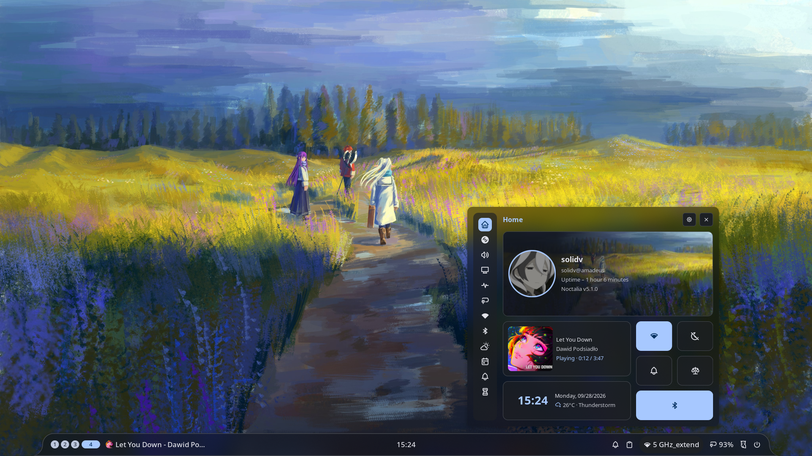
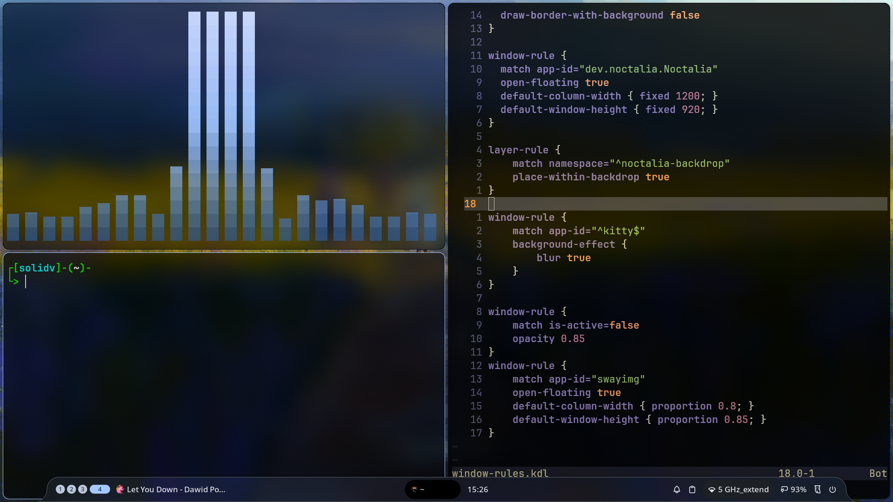
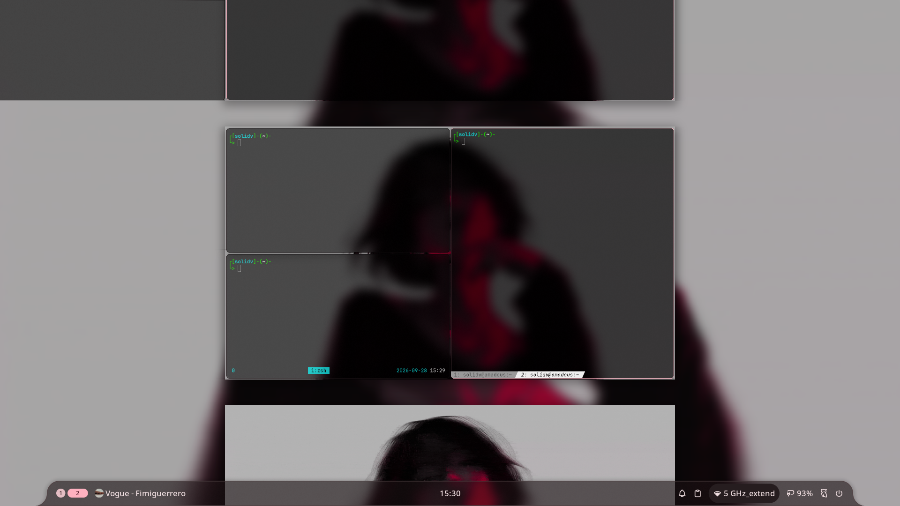
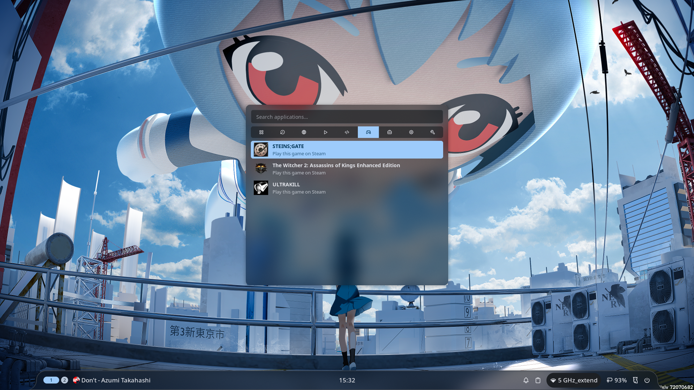

# dotfiles

My Arch Linux setup on a Lenovo Legion 5: **niri** (scrolling Wayland compositor) + **Noctalia** shell.

<table>
  <tr>
    <td></td>
    <td></td>
  </tr>
  <tr>
    <td colspan="2"></td>
  </tr>
</table>

---

## Setup

|                  |                                                            |
| ---------------- | ---------------------------------------------------------- |
| **OS**           | Arch Linux (btrfs, UKI boot, snapper snapshots)            |
| **Compositor**   | [niri](https://github.com/YaLTeR/niri)                     |
| **Shell / bar**  | [Noctalia](https://github.com/noctalia-dev/noctalia-shell) |
| **Terminal**     | kitty                                                      |
| **Shell**        | zsh + oh-my-zsh                                            |
| **Editor**       | Neovim (lazy.nvim)                                         |
| **File manager** | Nautilus                                                   |
| **Image viewer** | swayimg (glass background, vim keys)                       |
| **Media**        | mpv                                                        |
| **Audio**        | EasyEffects                                                |
| **Tools**        | btop, cava, fastfetch, lazygit, tmux, glow                 |
| **Theming**      | GTK 3/4, qt5ct/qt6ct, colours generated by Noctalia        |
| **Font**         | JetBrainsMono Nerd Font                                    |

---

## Structure

| Path                                                   | What's there                                              |
| ------------------------------------------------------ | --------------------------------------------------------- |
| `.config/niri/`                                        | Compositor: keybinds, window rules, blur, rounded corners |
| `.config/noctalia/`                                    | Bar, launcher, idle/lock settings                         |
| `.config/kitty/`                                       | Terminal: glass look, cursor trail, opacity keybinds      |
| `.config/nvim/`                                        | Neovim config                                             |
| `.config/swayimg/`                                     | Image viewer: translucent background, vim-style pan/zoom  |
| `.config/{btop,cava,fastfetch,lazygit,tmux,glow,mpv}/` | CLI/TUI tools                                             |
| `.config/{gtk-3.0,gtk-4.0,qt5ct,qt6ct,nwg-look}/`      | Theming                                                   |
| `.config/git/`, `.config/ideavim/`                     | Git and IdeaVim config                                    |
| `.zshrc`, `.bashrc`                                    | Shell config (history and caches kept out of `$HOME`)     |
| `.config/system/`                                      | System files outside `$HOME` + docs (see below)           |

---

## System config

Files that live outside `$HOME` (in `/etc`, `/usr`) are mirrored into [`.config/system/files/`](../.config/system/files) by [`sync.sh`](../.config/system/sync.sh):
NVIDIA hibernation fix, BD PROCHOT fix, zram, logind lid behaviour, snapper configs, and pacman hooks.

- 📘 [**System notes**](../.config/system/system-notes.md): what's customised, why, and a fresh-install checklist
- 🛟 [**Btrfs rollback guide**](../.config/system/btrfs-rollback.md): recovering from a bad update or a system that won't boot

> These files are hardware- and install-specific (Legion 5, NVIDIA hybrid graphics). Read them before copying anything.

---

## Credits

- [niri](https://github.com/YaLTeR/niri), [Noctalia](https://github.com/noctalia-dev/noctalia-shell), and everyone whose configs I learned from
